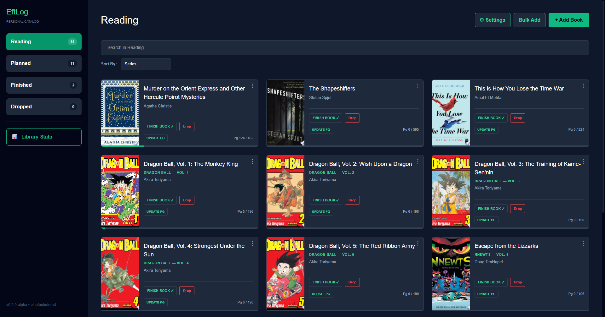
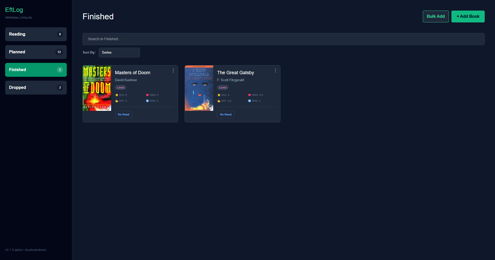
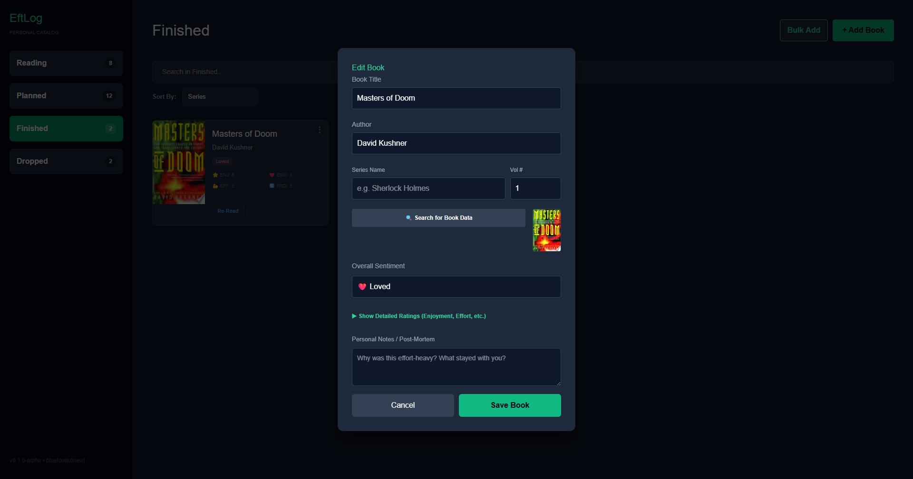

# EftLog 📚
**Personal Reading Catalog & Progress Tracker**

EftLog is a streamlined desktop application built with **Electron** and **React** designed to help readers catalog their personal libraries, track reading progress in real-time, and store detailed sentiments on completed books.

## ✨ Features
* **Live Progress Tracking:** Visual progress bars and a dedicated "Update Page" modal.
* **Automatic Metadata:** Integrates with the Google Books API to pull cover art and page counts.
* **Detailed Analytics:** Rate books based on Enjoyment, Emotional Impact, Effort, and Reread Potential.
* **Series Support:** Organize your collections with series name and volume numbering.
* **Smart Search & Sort:** Filter your shelves by title, author, progress, or series.

## 📸 Screenshots

### Main Dashboard - Reading Tab


### Main Dashboard - Finished Tab


### Editing a Book


## 🚀 Getting Started

### Prerequisites
* [Node.js](https://nodejs.org/) (v16 or higher)
* A Google Books API Key

### Installation
1.  **Clone the repository:**
    ```bash
    git clone [https://github.com/your-username/eft-log.git](https://github.com/your-username/eft-log.git)
    cd eft-log
    ```
2.  **Install dependencies:**
    ```bash
    npm install
    ```
3.  **Setup Environment Variables:**
    * Create a `.env` file in the root directory.
    * Add your Google Books API key:
        ```env
        VITE_GOOGLE_BOOKS_KEY=your_api_key_here
        ```

### Install

```bash
$ npm install
```

### Development

```bash
$ npm run dev
```

### Build

```bash
# For Windows
$ npm run build:win

# For macOS
$ npm run build:mac

# For Linux
$ npm run build:linux
```

🛠️ Built With

    React - UI Logic

    Electron - Desktop Environment

    TypeScript - Type Safety

    Google Books API - Book Metadata

📝 Note

This project is currently in Alpha (v0.1.0).

Developed by bluefootednewt.